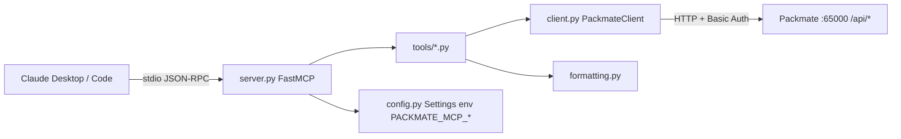

# Packmate MCP — Design Spec

Date: 2026-05-13
Status: Approved
Author: Ismail Galeev

## Summary

Build an MCP (Model Context Protocol) server in Python that wraps the [Packmate](https://gitlab.com/packmate/Packmate) REST API. The server exposes CRUD tools over `services`, `patterns`, `streams`, `packets`, and `pcap` lifecycle, letting an LLM analyze captured CTF traffic, create/modify ignore-and-highlight patterns, trigger lookback searches, and manage pcap-file processing.

Transport: **stdio** (Claude Desktop / Claude Code subprocess).
Connection to Packmate: HTTP + Basic Auth, default `http://localhost:65000`.
Distribution: **PyPI** under name `packmate-mcp`, installable via `uvx packmate-mcp`.

## Goals & Non-Goals

### Goals
- Cover the full REST API surface of Packmate (read + write).
- Make packet content readable for an LLM: transcripts with `client→server` labels by default, switchable to hex / Python `bytes` / base64.
- Hard limits on content size to protect LLM context window.
- Type-safe pydantic models matching Packmate DTOs.
- Pip-installable, runnable via `uvx`, configured purely through env vars.
- Trusted-Publishing PyPI release pipeline via GitHub Actions OIDC.

### Non-Goals
- No WebSocket real-time stream subscriptions (CRUD scope only).
- No direct PostgreSQL access — Packmate's REST API is the only data plane.
- No content-search tool beyond what Packmate's pattern system provides (LLM uses `create_pattern` + `pattern_lookback` + `list_streams(pattern_id)`).
- No TLS verification setting — Packmate is plain HTTP.
- No retry / circuit breaker / fallback — local tool, failures should surface immediately.
- No CLI flags — env vars only.

## Architecture

```
packmate-mcp/
├── pyproject.toml            # mcp[cli], httpx, pydantic, pydantic-settings; hatchling build
├── README.md                 # quickstart, Claude Desktop config, .env.example
├── CHANGELOG.md
├── .github/workflows/
│   ├── ci.yml                # pytest + ruff + mypy on push/PR
│   └── release.yml           # tag v*.*.* → uv build → PyPI Trusted Publish + GH Release
├── src/
│   └── packmate_mcp/
│       ├── __init__.py
│       ├── __main__.py       # main(): mcp.run(transport="stdio")
│       ├── server.py         # FastMCP("packmate"); registers tools, builds client from settings
│       ├── client.py         # PackmateClient: httpx.AsyncClient wrapper, typed exceptions
│       ├── config.py         # PackmateSettings (pydantic-settings, env prefix PACKMATE_MCP_)
│       ├── formatting.py     # format_content() — pure: transcript/text/hex/python_bytes/base64
│       ├── models.py         # pydantic: Service, Pattern, Stream, Packet, enums
│       └── tools/
│           ├── __init__.py   # register_all(mcp, client)
│           ├── services.py
│           ├── patterns.py
│           ├── streams.py
│           ├── packets.py
│           └── pcap.py
└── tests/
    ├── conftest.py
    ├── test_formatting.py
    ├── test_client.py
    ├── test_tools.py
    └── test_config.py
```

### Layer responsibilities

- **`client.py`** — the only place that knows about HTTP, auth, and URL paths. Each method returns a pydantic model (or `None` for void endpoints). Raises typed `PackmateError` subclasses.
- **`tools/*.py`** — each module registers its tools via `@mcp.tool()`. No HTTP code. Validates inputs through pydantic `Field` constraints; calls `client`; passes packet bytes through `format_content()`.
- **`formatting.py`** — pure synchronous function `format_content(packets, mode, max_bytes_per_packet, total_max_bytes, max_packets) -> str`. Zero external dependencies. Easy to unit-test exhaustively.
- **`config.py`** — `PackmateSettings(BaseSettings)`. Required fields fail at startup with a clear stderr message.
- **`server.py`** — wires settings → client → tools; calls `mcp.run(transport="stdio")`.



## Tools

16 tools across 5 resource groups.

### Services (4)

| Tool | Maps to | Notes |
|---|---|---|
| `list_services` | GET `/api/service/` | Returns `list[Service]` |
| `create_service` | POST `/api/service/` | Body: name, port, mergeAdjacentPackets, urldecodeHttpRequests, decryptTls, parseWebSockets, http, etc. (match `ServiceCreateDto`) |
| `update_service` | POST `/api/service/{port}` | Body: `ServiceUpdateDto` |
| `delete_service` | DELETE `/api/service/{port}` | Void |

### Patterns (6)

| Tool | Maps to | Notes |
|---|---|---|
| `list_patterns` | GET `/api/pattern/` | |
| `create_pattern` | POST `/api/pattern/` | Body: name, value, action (`FIND`/`IGNORE`), searchType (`SUBSTRING`/`REGEX`/`BINARY`), directionType (`INPUT`/`OUTPUT`/`BOTH`), color?, servicePort? |
| `update_pattern` | POST `/api/pattern/{id}` | |
| `delete_pattern` | DELETE `/api/pattern/{id}` | |
| `set_pattern_enabled` | POST `/api/pattern/{id}/enable?enabled=` | Bool query param |
| `pattern_lookback` | POST `/api/pattern/{id}/lookback` | Body: int minutes (`Field(ge=1)`) |

### Streams (4)

| Tool | Maps to | Notes |
|---|---|---|
| `list_streams` | POST `/api/stream/all` or `/api/stream/{port}` | Params: port?, starting_from?, page_size=20, favorites=False, pattern_id?. Returns `list[StreamSummary]` (metadata only) |
| `get_stream` | composes list + packets | Params: stream_id, content_format='transcript', max_bytes_per_packet=4096, total_max_bytes=64000, max_packets=200. Uses `list_streams(starting_from=id+1, page_size=1)` to fetch metadata (no direct GET-by-id endpoint exists); if the returned stream id ≠ requested id (e.g., stream was deleted) → `PackmateNotFoundError`. Then calls `get_packets` and `format_content`. |
| `get_packets` | POST `/api/packet/{streamId}` | Paginated: stream_id, starting_from?, page_size=50, content_format='transcript', max_bytes_per_packet=4096 |
| `set_stream_favorite` | POST `/api/stream/{id}/favorite` or `/unfavorite` | Single tool with `favorite: bool` param; chooses endpoint accordingly. Documented as "no error if stream id doesn't exist" |

### Pcap (2)

| Tool | Maps to | Notes |
|---|---|---|
| `pcap_status` | GET `/api/pcap/started` | Returns `{started: bool}` |
| `pcap_start` | POST `/api/pcap/start` | Then auto-calls `pcap_status`; returns `{started: bool, note?: str}`. If `started=false`, `note="Server may not be in FILE mode."` |

### Design decisions

- No `search_streams` — LLM composes via patterns. Native Packmate workflow: `create_pattern(FIND, SUBSTRING/REGEX/BINARY)` → `pattern_lookback` → `list_streams(pattern_id=...)`.
- Single `set_stream_favorite(favorite: bool)` instead of two tools, since both endpoints do the same thing with opposite values.
- `get_stream` is the only "thick" tool: it short-circuits a common two-call pattern (`list` + `get_packets`) into one call with trimming defaults applied. All other tools are 1:1 with REST endpoints.

## Content formatting

Pure function `format_content(packets, mode, max_bytes_per_packet, total_max_bytes, max_packets) -> str`.

### Modes

| Mode | Use case | Output |
|---|---|---|
| `transcript` (default) | Stream analysis, flag-hunting, HTTP/text protocols | Per-packet block with `client→server` / `server→client` label; text or hexdump body chosen by auto-detect |
| `text` | LLM wants to grep raw text | UTF-8 with `errors='backslashreplace'` |
| `hex` | Binary protocols, header inspection | Canonical hexdump: `OFFSET: HEX HEX ... ASCII` |
| `python_bytes` | Crafting an exploit payload | `b'\\x47\\x45\\x54\\x20...'` |
| `base64` | Passthrough to other tools | Raw base64 without wrapping |

### Transcript mode

Auto-detect per packet: if ≥90% of bytes are printable ASCII (`0x20`–`0x7e` plus `\t\r\n`), render body as text; otherwise as inline hexdump.

```
─── Packet #142 @ 12:34:56.123  client→server  (87 bytes) ───
GET /api/flag?user=admin HTTP/1.1
Host: target:8080

─── Packet #143 @ 12:34:56.234  server→client  (412 bytes) [tls_decrypted, http_body] ───
HTTP/1.1 200 OK
Content-Type: application/json

{"flag":"CTF{example}"}

─── Packet #144 @ 12:34:56.345  client→server  (32 bytes, binary) ───
00000000: 17 03 03 00 1b 00 00 00 00 00 00 00 01 a4 7e f2  ..............~.
00000010: c5 b1 8a d3 ...                                  ......
[truncated: 16 more bytes]
```

Flags shown in header only when set: `tls_decrypted`, `web_socket_parsed`, `ungzipped`, `http_body`.

### Trimming (three layers)

1. `max_bytes_per_packet` (default 4096) — per-packet cap. Marker `[truncated: N more bytes]` appended.
2. `total_max_bytes` (default 64000) — soft cap across formatted output. Remaining packets become `─── Packet #N (skipped: total budget exhausted) ───`.
3. `max_packets` (default 200) — hard cap on packet count.

All three exposed as optional parameters on `get_stream` and `get_packets`. LLM can widen/narrow as needed.

### Non-goals

- No TLS / WebSocket decoding (Packmate's optimizer already did it; we just label).
- No "pretty" JSON / XML formatting (non-deterministic, token-hungry; LLM decides).

## Configuration

`pydantic-settings`, env prefix `PACKMATE_MCP_`, no CLI flags.

| Env var | Default | Description |
|---|---|---|
| `PACKMATE_MCP_BASE_URL` | `http://localhost:65000` | Packmate base URL |
| `PACKMATE_MCP_LOGIN` | (required) | Basic auth login |
| `PACKMATE_MCP_PASSWORD` | (required) | Basic auth password |
| `PACKMATE_MCP_TIMEOUT_SECONDS` | `30` | httpx timeout |
| `PACKMATE_MCP_LOG_LEVEL` | `INFO` | Log level |

Page size defaults (`20` for streams, `50` for packets) live in tool signatures, not env.

### Example Claude Desktop config

```json
{
  "mcpServers": {
    "packmate": {
      "command": "uvx",
      "args": ["packmate-mcp"],
      "env": {
        "PACKMATE_MCP_BASE_URL": "http://localhost:65000",
        "PACKMATE_MCP_LOGIN": "BinaryBears",
        "PACKMATE_MCP_PASSWORD": "..."
      }
    }
  }
}
```

For local dev (running from a clone): `"command": "uv", "args": ["--directory", "/path/to/packmate-mcp", "run", "packmate-mcp"]`.

### Validation & logging

- `Settings()` runs at startup. Missing required field → `pydantic.ValidationError` → process exits with a clear stderr message (`PACKMATE_MCP_LOGIN must be set`).
- `.env` files are supported but not required (for local dev).
- `logging.basicConfig(stream=sys.stderr, level=...)` — **never** to stdout (MCP stdio invariant: stdout is JSON-RPC).

## Error handling

Two layers: `client.py` raises typed exceptions; tools let them propagate so FastMCP converts them to `isError: true` results.

### Exception hierarchy

```python
class PackmateError(Exception): ...
class PackmateConnectionError(PackmateError): ...   # network / timeout
class PackmateAuthError(PackmateError): ...         # 401 / 403
class PackmateNotFoundError(PackmateError): ...     # 404
class PackmateValidationError(PackmateError): ...   # 4xx with body
class PackmateServerError(PackmateError): ...       # 5xx
```

Mapping happens in `_request()` of `PackmateClient`. Messages are written for the LLM, not the developer.

### Sample messages

| Case | Message |
|---|---|
| `httpx.ConnectError` | `Cannot reach Packmate at {base_url}. Is the server running?` |
| `httpx.TimeoutException` | `Request to {method} {path} timed out after {n}s.` |
| 401/403 | `Authentication failed. Check PACKMATE_MCP_LOGIN and PACKMATE_MCP_PASSWORD env vars.` |
| 404 | `{Resource} not found: {id}.` (tool fills resource name) |
| 4xx with body | `Packmate rejected request: {response_body}` |
| 5xx | `Packmate server error ({status}). Check Packmate logs. Body: {body}` |

### Packmate-specific quirks

- **`pcap_start` outside FILE mode**: endpoint always returns 200 — silently ignored. Tool follows up with `pcap_status` and includes `note` if `started=false`.
- **`pattern_lookback(minutes < 1)`**: Packmate silently returns. Pre-validate via `Field(ge=1)`; never reach the wire.
- **`delete_*` of nonexistent**: status unpredictable (depends on Spring config); surface response as-is.
- **`favorite/unfavorite` of nonexistent stream**: returns 200, no row affected. Document in tool docstring.

### Tool layer policy

- Don't catch `PackmateError` — let it bubble to FastMCP.
- Validate input through pydantic `Field` constraints (`ge=`, `le=`, regex, enum types).
- Inject context when raising `PackmateNotFoundError` (e.g., `raise PackmateNotFoundError(f"Stream {id} not found.")`).
- Log every PackmateError at `WARNING`; full traceback at `DEBUG`.

## Testing

Stack: `pytest`, `pytest-asyncio`, `respx`, `pytest-cov`. Goal: 85%+ coverage on `client.py` and `formatting.py`.

### `test_formatting.py` (most logic)

- All 5 modes
- `transcript` text packet → text body
- `transcript` binary packet → inline hexdump
- `transcript` mixed → per-packet auto-detect
- `hex` canonical layout (16 bytes/row, ASCII gutter)
- `python_bytes` escapes (`\x00`, `\n`, `\\`, `'`)
- `base64` round-trip
- `text` invalid UTF-8 → `backslashreplace`
- Trimming:
  - `max_bytes_per_packet` triggers marker
  - `total_max_bytes` exhausted → `(skipped)` markers
  - `max_packets` first to trigger
  - All three combined

### `test_client.py`

`respx` mocks for `httpx.AsyncClient`:
- Each method returns the right pydantic model (happy path).
- Request serialization (`create_pattern` body, `list_streams` uses `POST /api/stream/all` with `StreamPagination`).
- Error mapping: 401 → AuthError, 404 → NotFoundError, 500 → ServerError with body, `ConnectError`/`TimeoutException` → ConnectionError.
- Basic auth header present on each request.

### `test_tools.py`

One or two integration-style tests per group via `respx`:
- `get_stream` calls `list_streams(starting_from=id+1, page_size=1)` + `get_packets`, output passes through `format_content`.
- `set_stream_favorite(True)` → POST `/favorite`; `False` → POST `/unfavorite`.
- `pattern_lookback(0)` → ValidationError before any HTTP.
- `pcap_start` follows up with `pcap_status`; `note` populated correctly when not in FILE mode.

### `test_config.py`

- Missing `PACKMATE_MCP_LOGIN` → ValidationError.
- Defaults applied (`base_url`, `timeout`).
- `.env` picked up.

### Out of scope

- Live Packmate integration — manual smoke test in `README.md` (run docker-compose, run `packmate-mcp` under MCP Inspector).
- FastMCP internals — covered by SDK tests.

### CI (`ci.yml`)

```yaml
on: [push, pull_request]
jobs:
  test:
    runs-on: ubuntu-latest
    steps:
      - uses: actions/checkout@v4
      - uses: astral-sh/setup-uv@v3
      - run: uv sync --dev
      - run: uv run pytest --cov=src/packmate_mcp
      - run: uv run ruff check src tests
      - run: uv run mypy src
```

## PyPI publishing

Goal: `pip install packmate-mcp` or `uvx packmate-mcp`.

### `pyproject.toml`

```toml
[project]
name = "packmate-mcp"
version = "0.1.0"
description = "MCP server for Packmate — CTF network traffic analyzer"
readme = "README.md"
requires-python = ">=3.10"
license = { text = "MIT" }
authors = [{ name = "Ismail Galeev" }]
keywords = ["mcp", "packmate", "ctf", "network", "traffic-analysis"]
classifiers = [
  "Development Status :: 4 - Beta",
  "Intended Audience :: Information Technology",
  "License :: OSI Approved :: MIT License",
  "Programming Language :: Python :: 3.10",
  "Programming Language :: Python :: 3.11",
  "Programming Language :: Python :: 3.12",
  "Programming Language :: Python :: 3.13",
  "Topic :: Security",
]
dependencies = [
  "mcp[cli]>=1.2.0",
  "httpx>=0.27",
  "pydantic>=2.0",
  "pydantic-settings>=2.0",
]

[project.scripts]
packmate-mcp = "packmate_mcp.__main__:main"

[project.urls]
Homepage = "https://github.com/umbra2728/packmate-mcp"
Issues = "https://github.com/umbra2728/packmate-mcp/issues"

[build-system]
requires = ["hatchling"]
build-backend = "hatchling.build"

[tool.hatch.build.targets.wheel]
packages = ["src/packmate_mcp"]
```

Decisions:
- `requires-python = ">=3.10"` (not 3.13 from the scaffold) — MCP SDK floor is 3.10.
- Build backend `hatchling` (not `uv_build`, still beta).

### Versioning

- SemVer. `0.x.y` until live-Packmate smoke test runs in CI.
- Single source of truth: `pyproject.toml` `version`. Runtime can read via `importlib.metadata.version("packmate-mcp")`.
- Tag `vX.Y.Z` triggers release.

### `release.yml`

PyPI Trusted Publishing via OIDC (no token in repo):

```yaml
on:
  push:
    tags: ["v*.*.*"]

jobs:
  release:
    runs-on: ubuntu-latest
    environment: pypi
    permissions:
      id-token: write
      contents: write
    steps:
      - uses: actions/checkout@v4
      - uses: astral-sh/setup-uv@v3
      - run: uv sync --dev
      - run: uv run pytest
      - run: uv build
      - uses: pypa/gh-action-pypi-publish@release/v1
      - uses: softprops/action-gh-release@v2
        with:
          generate_release_notes: true
          files: dist/*
```

One-time setup (in `README.md`):
1. PyPI → Account settings → Add pending publisher (repo, workflow `release.yml`, environment `pypi`).
2. GitHub repo → Settings → Environments → create `pypi`.

### Release checklist

1. Bump version in `pyproject.toml`.
2. Update `CHANGELOG.md` (Keep a Changelog format).
3. `git commit -am "Release vX.Y.Z" && git tag vX.Y.Z && git push --tags`.
4. Workflow runs → package on PyPI + GitHub Release.

### Out of scope

- Manual `twine upload` — Trusted Publishing only.
- `setup.py` / `setup.cfg` — pyproject only.
- `bump-my-version` / `python-semantic-release` automation — manual bumps for 0.x.
- Test PyPI workflow — can add later as `workflow_dispatch`.

## Open questions

None — all design decisions resolved during brainstorming. The remaining work is execution.
